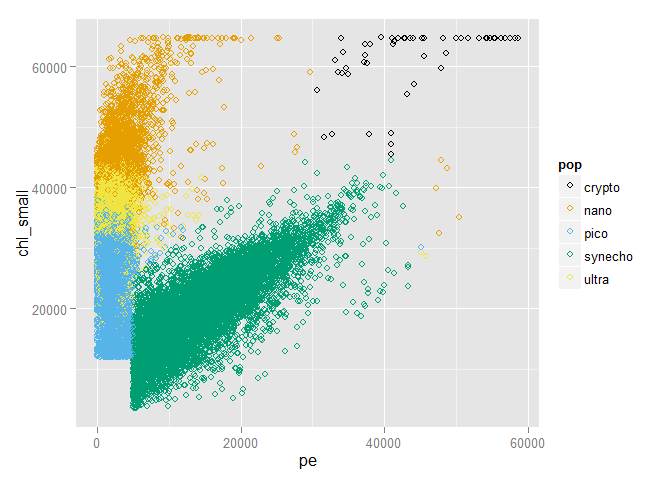

# Classification of Microbes
Matthew Honaker  
##Introduction
Analysis and predictions using data from the SeaFlow instrument, developed in the [Armbrust Lab](http://http://armbrustlab.ocean.washington.edu/). This is a flow cytometry instrument which is deployed off reserach vessels in the ocean to collect data and categorize ocean based microbial life. Flow cytometry uses the reflection and refcraction of laser light at different wavelengths to gather information about size and pigmentation of single cell organisms flowing through a caplillary.

A series of questions were posed for this exercise, and a sample data set was provided. The sample dataset was 21 minutes of collected data from the instrument, formatted into a CSV file. The excercise was to have been completed in R. All code used below is my own. While I have tried to be clear, this document is *not* intended to be a full report, and is not formatted as such.


```r
# a little set up
library(ggplot2); library(caret); library(randomForest)
library(rpart); library(tree); library(e1071)
library(doParallel)

#multi-core use
cl <- makeCluster(detectCores())
registerDoParallel(cl)

#load the data
data <- read.csv("seaflow_21min.csv")
```

**Question 1:** How many particles labeled "synecho" are in the file provided?

```r
sum(data$pop == 'synecho')
```

```
## [1] 18146
```

**Question 2:** What is the 3rd Quantile of the field fsc_small?

```r
summary(data$fsc_small)
```

```
##    Min. 1st Qu.  Median    Mean 3rd Qu.    Max. 
##   10000   31340   35480   34920   39180   65420
```

**Question 3:** What is the mean of the variable "time" for your training set?
Note that it was specified that the sample dataset was to be divided into two equal halves for this exercise.

```r
intrain1 <- createDataPartition(y=data$pop, p=0.5, list=F)
train1 <- data[intrain1,]
test1 <- data[-intrain1,]
mean(train1$time)
```

```
## [1] 342.1535
```

**Question 4:** Plot pe vs. chl_small. Particles labeled ultra should appear to be somewhat "mixed" with two other populations of particles. Which two populations? (see plot)

```r
cbPalette <- c("#000000", "#E69F00", "#56B4E9", "#009E73", "#F0E442", "#0072B2", "#D55E00", "#CC79A7")
ggplot(train1, aes(x=pe, y=chl_small, color=pop)) + geom_point(shape=1) + scale_colour_manual(values=cbPalette)
```

 

The next series of questions (5, 6, 7) were to be answered by training a decision tree.

```r
model2 <- train(pop ~ fsc_small + fsc_perp + fsc_big + pe + chl_big + chl_small, data=train1, method="rpart2")
print(model2$finalModel)
```

```
## n= 36172 
## 
## node), split, n, loss, yval, (yprob)
##       * denotes terminal node
## 
##  1) root 36172 25742 pico (0.0014 0.18 0.29 0.25 0.28)  
##    2) pe< 5006.5 26321 15944 pico (0 0.22 0.39 3.8e-05 0.38)  
##      4) chl_small< 32190.5 11333  1905 pico (0 0.00026 0.83 8.8e-05 0.17) *
##      5) chl_small>=32190.5 14988  6760 ultra (0 0.39 0.063 0 0.55)  
##       10) chl_small>=41065.5 5447   776 nano (0 0.86 0 0 0.14) *
##       11) chl_small< 41065.5 9541  2089 ultra (0 0.12 0.099 0 0.78) *
##    3) pe>=5006.5 9851   779 synecho (0.0052 0.054 0.0054 0.92 0.014)  
##      6) chl_small>=38886.5 628   112 nano (0.081 0.82 0 0.043 0.054) *
##      7) chl_small< 38886.5 9223   178 synecho (0 0.0021 0.0057 0.98 0.011) *
```

**Question 5:** Which populations, if any, is your tree incapable of recognizing?

Crypto is not on any branch, there are too few examples in this case.

**Question 6:** What is the value of the threshold on the pe field learned in your model?

The threshold for going down the pe branch is 5004.

**Question 7:** Which variables appear to be most important in predicting the class population?

The most important variables are the pe and chl_small variables.

**Question 8:** How accurate was your decision tree on the test data? Enter a number between 0 and 1.

```r
predictions2 <- predict(model2, test1)
sum(predictions2 == test1$pop) / length(test1$pop)
```

```
## [1] 0.8535291
```

**Question 9:** What was the accuracy of your random forest model on the test data?

```r
model3 <- train(pop ~ fsc_small + fsc_perp + fsc_big + pe + chl_big + chl_small, data=train1, method="rf")
predictions3 <- predict(model3, test1)
sum(predictions3 == test1$pop) / length(test1$pop)
```

```
## [1] 0.9199912
```

**Question 10:** What are the most important variables in terms of the gini impurity measure?

```r
varImp(model3)
```

```
## rf variable importance
## 
##           Overall
## pe         100.00
## chl_small   95.52
## chl_big     51.12
## fsc_small   28.01
## fsc_perp    21.85
## fsc_big      0.00
```

**Question 11:** What is the accuracy of your support vector machine model on the test data?

```r
model4 <- svm(pop ~ fsc_small + fsc_perp + fsc_big + pe + chl_big + chl_small, data = train1)
predictions4 <- predict(model4, test1)
sum(predictions3 == test1$pop) / length(test1$pop)
```

```
## [1] 0.9199912
```

**Question 12:** Construct a confusion matrix for each of the three models. What is the most common error that the models make?

Ultra is mistaken for pico...see confusion matricies below

**Decision Tree**

```r
confusionMatrix(predictions2, test1$pop)
```

```
## Confusion Matrix and Statistics
## 
##           Reference
## Prediction crypto nano pico synecho ultra
##    crypto       0    0    0       0     0
##    nano        51 5117    1      33   837
##    pico         0    1 9430       4  2025
##    synecho      0   20   39    9036   116
##    ultra        0 1211  960       0  7290
## 
## Overall Statistics
##                                           
##                Accuracy : 0.8535          
##                  95% CI : (0.8498, 0.8572)
##     No Information Rate : 0.2884          
##     P-Value [Acc > NIR] : < 2.2e-16       
##                                           
##                   Kappa : 0.8024          
##  Mcnemar's Test P-Value : NA              
## 
## Statistics by Class:
## 
##                      Class: crypto Class: nano Class: pico Class: synecho
## Sensitivity                0.00000      0.8060      0.9041         0.9959
## Specificity                1.00000      0.9691      0.9211         0.9935
## Pos Pred Value                 NaN      0.8473      0.8229         0.9810
## Neg Pred Value             0.99859      0.9591      0.9595         0.9986
## Prevalence                 0.00141      0.1755      0.2884         0.2508
## Detection Rate             0.00000      0.1415      0.2607         0.2498
## Detection Prevalence       0.00000      0.1670      0.3168         0.2547
## Balanced Accuracy          0.50000      0.8875      0.9126         0.9947
##                      Class: ultra
## Sensitivity                0.7100
## Specificity                0.9162
## Pos Pred Value             0.7705
## Neg Pred Value             0.8885
## Prevalence                 0.2839
## Detection Rate             0.2015
## Detection Prevalence       0.2616
## Balanced Accuracy          0.8131
```

**Random Forest**

```r
confusionMatrix(predictions3, test1$pop)
```

```
## Confusion Matrix and Statistics
## 
##           Reference
## Prediction crypto  nano  pico synecho ultra
##    crypto      50     1     0       0     0
##    nano         0  5544     0       2   362
##    pico         0     0 10104       0  1388
##    synecho      1     2     5    9070     9
##    ultra        0   802   321       1  8509
## 
## Overall Statistics
##                                           
##                Accuracy : 0.92            
##                  95% CI : (0.9171, 0.9228)
##     No Information Rate : 0.2884          
##     P-Value [Acc > NIR] : < 2.2e-16       
##                                           
##                   Kappa : 0.892           
##  Mcnemar's Test P-Value : NA              
## 
## Statistics by Class:
## 
##                      Class: crypto Class: nano Class: pico Class: synecho
## Sensitivity               0.980392      0.8732      0.9687         0.9997
## Specificity               0.999972      0.9878      0.9461         0.9994
## Pos Pred Value            0.980392      0.9384      0.8792         0.9981
## Neg Pred Value            0.999972      0.9734      0.9868         0.9999
## Prevalence                0.001410      0.1755      0.2884         0.2508
## Detection Rate            0.001382      0.1533      0.2793         0.2508
## Detection Prevalence      0.001410      0.1633      0.3177         0.2512
## Balanced Accuracy         0.990182      0.9305      0.9574         0.9995
##                      Class: ultra
## Sensitivity                0.8287
## Specificity                0.9566
## Pos Pred Value             0.8833
## Neg Pred Value             0.9337
## Prevalence                 0.2839
## Detection Rate             0.2352
## Detection Prevalence       0.2663
## Balanced Accuracy          0.8926
```

**SVM**

```r
confusionMatrix(predictions4, test1$pop)
```

```
## Confusion Matrix and Statistics
## 
##           Reference
## Prediction crypto  nano  pico synecho ultra
##    crypto      47     1     0       2     0
##    nano         3  5610     0       3   386
##    pico         0     0 10052      18  1361
##    synecho      1     2    73    9050     6
##    ultra        0   736   305       0  8515
## 
## Overall Statistics
##                                           
##                Accuracy : 0.9199          
##                  95% CI : (0.9171, 0.9227)
##     No Information Rate : 0.2884          
##     P-Value [Acc > NIR] : < 2.2e-16       
##                                           
##                   Kappa : 0.892           
##  Mcnemar's Test P-Value : NA              
## 
## Statistics by Class:
## 
##                      Class: crypto Class: nano Class: pico Class: synecho
## Sensitivity               0.921569      0.8836      0.9638         0.9975
## Specificity               0.999917      0.9869      0.9464         0.9970
## Pos Pred Value            0.940000      0.9347      0.8794         0.9910
## Neg Pred Value            0.999889      0.9755      0.9847         0.9991
## Prevalence                0.001410      0.1755      0.2884         0.2508
## Detection Rate            0.001299      0.1551      0.2779         0.2502
## Detection Prevalence      0.001382      0.1659      0.3160         0.2525
## Balanced Accuracy         0.960743      0.9352      0.9551         0.9972
##                      Class: ultra
## Sensitivity                0.8293
## Specificity                0.9598
## Pos Pred Value             0.8911
## Neg Pred Value             0.9341
## Prevalence                 0.2839
## Detection Rate             0.2354
## Detection Prevalence       0.2642
## Balanced Accuracy          0.8945
```

**Question 13:** The variables in this dataset were assumed to continuous, but one of them only takes on a few discreet values, suggesting a problem, Which variable exhibits this problem?

fsc_big exhibits this problem, with only 6 different values.

```r
length(unique(data$fsc_small))
```

```
## [1] 13754
```

```r
length(unique(data$fsc_perp))
```

```
## [1] 12665
```

```r
length(unique(data$fsc_big))
```

```
## [1] 6
```

```r
length(unique(data$pe))
```

```
## [1] 9544
```

```r
length(unique(data$chl_small))
```

```
## [1] 15974
```

```r
length(unique(data$chl_big))
```

```
## [1] 2144
```

**Question 14:** After removing data associated with file_id 208, what was the effect on the accuracy of your svm model?

```r
data2 <- data[!data$file_id == 208,]
intrain2 <- createDataPartition(y=data2$pop, p=0.5, list=F)
train2 <- data2[intrain2,]
test2 <- data2[-intrain2,]
model5 <- svm(pop ~ fsc_small + fsc_perp + fsc_big + pe + chl_big + chl_small, data = train2)
predictions5 <- predict(model5, test2)
sum(predictions5 == test2$pop) / length(test2$pop) - sum(predictions3 == test1$pop) / length(test1$pop)
```

```
## [1] 0.05203682
```
